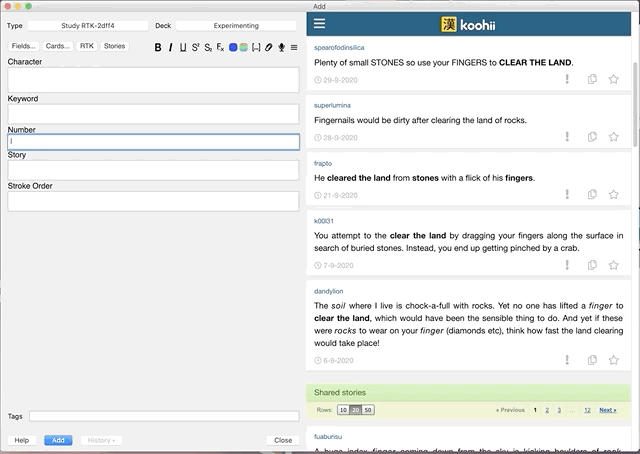

# RTK Companion

> This is an Addon for [Anki](https://apps.ankiweb.net/) aiming to assist in creating flashcards for Kanji learners going through the 6th edition of
the well renowned Remembering The Kanji book.

### Version

This Addon is compatible with Anki 2.1x only.

### Status
Ongoing experiment
Here is an image of the current state of the MVP.

