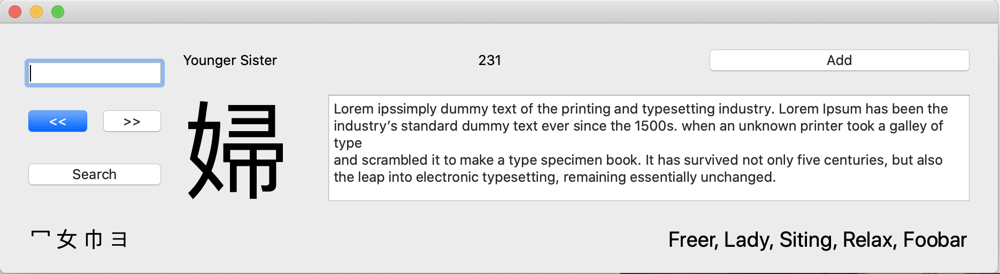

# Different Approach to the MVP

* Status: accepted
* Deciders: Me
* Date: 2020-10-07

Technical Story: Describe an MVP

## Context and Problem Statement

After experimenting with the previous MVP goal defined by [ADR-0002](0002-define-goal-for-an-mvp.md), I've decided it's not a good approach.
My main issue with is that in a way, it is re-creating Anki's "Add Card" screen, albeit a custom one which adds RTK cards.
Here's a screenshot of the UI created and filled with placeholder text.

While I still think it'd be cool to have an RTK browser in Anki and working with QT is ....interesting, I thought
a simpler approach should be sought.
So the problem stands, what should be done as an MVP and what should it contain?

## Decision Outcome

After some experimenting and research, I've decided an MVP should augment the `Add Card`. 
Here's the vision of how a user interacts with the MVP.
1. User opens the `Add Card` window which has a "RTK" button, and a "Stories" button.
1. User types in their desired Heisig Kanji number is the "Number" field.
1. User clicks the RTK button and the character, and stroke order get auto filled.
1. User clicks "Stories" button, which opens an embedded browser window to user stories.

### Positive Consequences <!-- optional -->

- The approach is simpler. 
- We keep Building UI elements with `QT` to a minimum under this approach.

### Negative Consequences <!-- optional -->

- We leave out Additional keyword meanings and the radicals for the Kanji

## Links <!-- optional -->

* [Supersedes] [0002](0002-define-goal-for-an-mvp.md)
